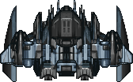

[![Contributors][contributors-shield]][contributors-url]
[![Forks][forks-shield]][forks-url]
[![Stargazers][stars-shield]][stars-url]
[![Issues][issues-shield]][issues-url]
[![MIT License][license-shield]][license-url]
[![LinkedIn][linkedin-shield]][linkedin-url]

<!-- PROJECT LOGO -->
 

  
   
  
  
  

  <!-- Phaser logo -->
  
  <!-- JS ES6 logo -->
  
  <!-- Webpack logo -->
    
  <!-- Eslint logo -->
    
  <!-- Jest logo -->
    
  <!-- npm logo -->
    
  

  <h3 align="center">Cosmos Wars: Shooter Game</h3>

  

    A shooter game developed with phaser 3.5 game development framework
     
    <a href="https://github.com/RaminMammadzada/js-shooter-game"><strong>Explore the docs »</strong></a>
     
     
    <a href="https://raminmammadzada.github.io/js-shooter-game/index.html/">Play the game online</a>
    ·
    <a href="https://github.com/RaminMammadzada/js-shooter-game/issues">Report Bug</a>
    ·
    <a href="https://github.com/RaminMammadzada/js-shooter-game/issues">Request Feature</a>
  

<!-- TABLE OF CONTENTS -->

# Table of Contents

  <ol>
    <li>
      <a href="#about-the-project">About The Project</a>
      <ul>
        <li><a href="#Instructions">Instructions</a></li>
        <li><a href="#Live">Live Demo</a></li>
        <li><a href="#built-with">Built With</a></li>
      </ul>
    </li>
    <li>
      <a href="#getting-started">Getting Started</a>
      <ul>
        <li><a href="#Prerequisites">Prerequisites</a></li>
        <li><a href="#Installation">Installation</a></li>
        <li><a href="#Testing">Testing</a></li>
        <li><a href="#Other-Info">Other information</a></li>
      </ul>
    </li>
    <li><a href="#roadmap">Author</a></li>
    <li><a href="#contributing">Contributing</a></li>
    <li><a href="#license">License</a></li>
    <li><a href="#contact">Contact</a></li>
    <li><a href="#acknowledgements">Acknowledgements</a></li>
  </ol>

<!-- ABOUT THE PROJECT -->

## About The Project

It is a HTML5 game developed with [Phaser](https://phaser.io/) game development library. The he game inspired from this [Space Shooter project](https://learn.yorkcs.com/category/tutorials/gamedev/phaser-3/build-a-space-shooter-with-phaser-3/) and implemented by using game development best practices as much as possible.

The specific [requirements](https://www.notion.so/Shooter-game-203e819041c7486bb36f9e65faecba27) are followed throughout the project. The game works on desktop computers and on mobile devices. Several features are developed to work differently for the mobile devices specifically, becuase there is not keybaord in mobile devices and other way of player relocation must be done.

### Instructions

You will start this game by having control of a player spaceship to move around and destroy enemy ship. Read the control instruction carefully below.

- The game starts by loading and asking you to insert your name. After that, click on the Play button to start the game.
- You will be spawned on the top left corner of the screen.
- From there, user can navigate by clicking to the specific location which you want to go. User can rotate the ship body using the mouse on desktop computers. The rotation feature in mobile device is calculated automatically when the aimed location to move is clicked.
- User can fire a bullet by clicking `spacebar key` in keyboard. The target location which the bullet is send is specified by mouse `pointer`.
- Enemy ship are designed to chase the player ship if user gets close to it. The enemy ship generally goes slower that user ship, although when it is attacked by the the player ship, it increases its speed and towards the player ship.
- Player and enemy powers (healths) are displayed on the top of the screen.
- There are extra disturbors in the game, there are stones. Player's power gets lower when they touch to player. However, the player can detroy them by fire bullet to them and can get score.

- When player dies, it can restart the game or can go to leaderboard scene. Either way, your score, and name will be uploaded to the leaderboard API.
- On the title screen and during the game, user can mute or unmute the background music of the game by clicking the music icon on the bottom left corner of the screen. User can also turn audios (such as shooting, explosion) on and off if needed by clicking the sound icon in the bottom right corner of the screen. you can navigate to the options screen to turn audio on/off.

### Live Demo

[Play the game online on GitHub Page](https://raminmammadzada.github.io/js-shooter-game/index.html

### Built With

- [Phaser 3.5](https://phaser.io/)
- Javascript ES6
- Canvas
- HTML
- npm
- Webpack
- Jest
- Eslint
- Babel

<!-- GETTING STARTED -->

## Getting Started

To set this project upon a local environment clone, or download this repo and follow the instructions below.

### Prerequisites

- Web browser
- CLI tool
- npm
  `npm install npm@latest -g`

**Very Important Note: Some browsers may have their GPU hardware acceleration turned off. You have to turn this feature or for a smooth gaming experience. For example, use [this](https://www.lifewire.com/hardware-acceleration-in-chrome-4125122) instruction to turn chrome's GPU feature on if you experience a lag**

### Installation

1. Navigate to the root folder of your local copy and, using any CLI tool, type `npm install`, and press Enter. These will install the dependencies.
2. After it is completed,

- If you want to repack the file
  - Run `npm run build` to pack the files in the src folder
  - Go to the build folder and open index.html
- Else
  - Run `npm run start` to open it on a live server. In webpack config, the port is set to 8072.

### Testing

- Navigate to the root folder of your local copy and type `npm run test` or `npm run test-watch` to run jest.
- You can add more tests in the `./test` directory.

### other information

- if you run into `npm ERR! Unexpected end of JSON input while parsing near...` run the following in their respective order. `npm config set fetch-retry-maxtimeout 60000` then
  `npm cache clean --force && npm i`

<!-- CONTRIBUTING -->

## Contributing

Contributions are what make the open-source community such an amazing place to learn, inspire, and create. Any contributions you make are **greatly appreciated**.

1. Fork the Project
2. Create your Feature Branch (`git checkout -b feature/AmazingFeature`)
3. Commit your Changes (`git commit -m 'Add some AmazingFeature'`)
4. Push to the Branch (`git push origin feature/AmazingFeature`)
5. Open a Pull Request

## Author

👤 **Ramin Mammadzada**

- Github: [@RaminMammadzada](https://github.com/RaminMammadzada)
- Twitter: [@RaminMammadzada](https://twitter.com/RaminMammadzada)
- Linkedin: [@RaminMammadzada](https://www.linkedin.com/in/raminmammadzada)

<!-- LICENSE -->

## License

This project is [MIT]('./LICENSE.txt') licensed.

## Show your support

Give a ⭐️ if you like this project!

<!-- ACKNOWLEDGEMENTS -->

## Acknowledgements

- [Microverse](Microverse.org)
- [Phaser.io](https://phaser.io/)
- [Free Sound](http://freesound.org/)
- [Open Game Art](https://opengameart.org/)
- [Text Craft](https://textcraft.net)

[contributors-shield]: https://img.shields.io/github/contributors/RaminMammadzada/js-shooter-game.svg?style=for-the-badge
[contributors-url]: https://github.com/RaminMammadzada/js-shooter-game/graphs/contributors
[forks-shield]: https://img.shields.io/github/forks/RaminMammadzada/js-shooter-game.svg?style=for-the-badge
[forks-url]: https://github.com/RaminMammadzada/js-shooter-game/network/members
[stars-shield]: https://img.shields.io/github/stars/RaminMammadzada/js-shooter-game.svg?style=for-the-badge
[stars-url]: https://github.com/RaminMammadzada/js-shooter-game/stargazers
[issues-shield]: https://img.shields.io/github/issues/RaminMammadzada/js-shooter-game.svg?style=for-the-badge
[issues-url]: https://github.com/RaminMammadzada/js-shooter-game/issues
[license-shield]: https://img.shields.io/github/license/RaminMammadzada/js-shooter-game.svg?style=for-the-badge
[license-url]: https://github.com/RaminMammadzada/js-shooter-game/blob/development/LICENSE.txt
[linkedin-shield]: https://img.shields.io/badge/-LinkedIn-black.svg?style=for-the-badge&logo=linkedin&colorB=555
[linkedin-url]: https://www.linkedin.com/in/raminmammadzada/
[product-screenshot]: public/logo1.pngd
